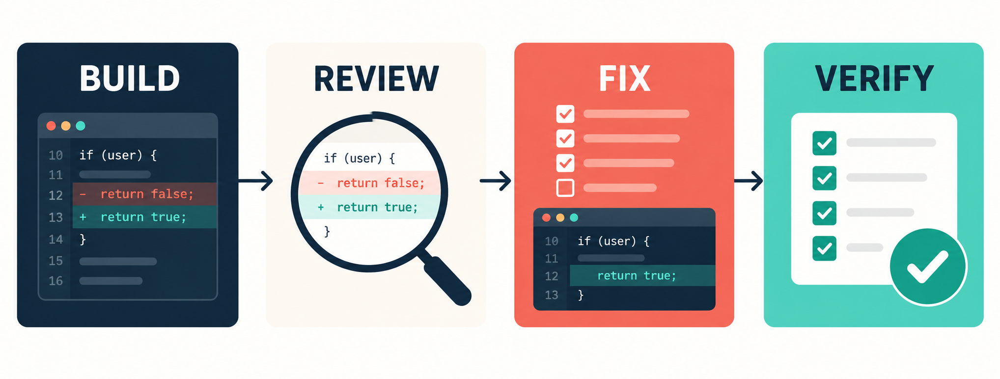
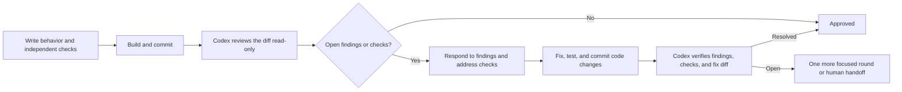

# Adversarial Review Kit



**A guided way to have Codex review a change built in Claude Code.** The second model receives the Git diff and an independent review card. Every finding gets a response, and a focused second pass checks the fix. The skill walks a new user through setup and the first run.

## Why a second model helps

The builder knows the choices it made while writing the code. Codex reviews from a fresh starting point: the intended behavior, the committed diff, and the checks, without the builder's conversation. Using a different model family gives the review another way to trace the code and challenge assumptions shared by the implementation and its tests. GPT-powered Codex is especially useful for finding concrete failure cases, missing input validation, regressions, and tests that pass while the behavior is wrong. In the [parser walkthrough](examples/verified-walkthrough.md), it found a validation bug and the missing tests that let it pass unnoticed. Its findings still need independent checks and human judgment.



The input card is the important addition. It tells the reviewer what the code is supposed to do before the reviewer sees how it was built. It also asks which test could pass while the behavior is wrong. The runner freezes the card for a review, so a later fix cannot quietly weaken the criteria. Its `## Test commands` section is required, with one complete command per line in backticks. The runner shows the parsed commands before review. Missing or failed acceptance checks receive IDs and remain open; navigation commands are recorded without blocking approval.

## Let your coding assistant set it up

Open Claude Code and paste this:

> Help me install `https://github.com/aiwriter28/adversarial-review-kit`. Clone the kit to `~/.local/share/adversarial-review-kit`, inspect its README and SKILL.md, and install only SKILL.md to `~/.claude/skills/adversarial-review/`. Check Python, Git, Codex CLI, and Codex login. Explain my Codex access options, then guide me through the review input card and one first review in my current project. Show me what you checked and explain any missing prerequisite before changing configuration.

The assistant can handle the checks and installation. It may need you to complete the interactive Codex sign-in. The first supported setup is Claude Code building and Codex CLI reviewing.

If you prefer to install it yourself:

```bash
mkdir -p ~/.local/share
git clone https://github.com/aiwriter28/adversarial-review-kit.git ~/.local/share/adversarial-review-kit
mkdir -p ~/.claude/skills/adversarial-review
cp ~/.local/share/adversarial-review-kit/SKILL.md ~/.claude/skills/adversarial-review/SKILL.md
codex login status
```

Start a new Claude Code session and run `/adversarial-review setup`. Claude Code loads personal skills from `~/.claude/skills/`; the skill's `setup` instructions check the environment and prepare a first review. The runner stays in the normal checkout under `~/.local/share/`. Read SKILL.md before installing any repository that can guide an assistant's tool use.

Requirements: Python 3.9+, Git 2.28+, [Claude Code](https://code.claude.com/docs/en/overview), and an authenticated [Codex CLI](https://developers.openai.com/codex/cli). You need Codex access for the independent review. The usual path is `codex login` with a ChatGPT plan that includes Codex. A paid plan is practical for repeated high-effort reviews, but [current access also includes Free and Go with plan-dependent limits](https://help.openai.com/en/articles/11369540-using-codex-with-your-chatgpt-plan). Alternatively, [Codex CLI supports API-key sign-in with separate usage-based billing](https://developers.openai.com/codex/auth). The kit uses Python's standard library and never needs an API key in the repository.

## First review, step by step

1. In the target Git repository, run `cp ~/.local/share/adversarial-review-kit/templates/review-card.md review-card.md`. Fill in intended behavior, independently expected results, constraints, and at least one command under `## Test commands`. Put each complete command on its own line in backticks, such as `` `python3 -m unittest` ``. The [filled parser example](examples/parser-review-card.md) shows the level of detail.
   Codex runs in a read-only sandbox, so choose commands that can run without writing cache or fixture files. For Python, include `PYTHONDONTWRITEBYTECODE=1` in the card command if needed. A blocked card command stays open until it runs or the card is revised and the review restarted.
2. Run `git rev-parse HEAD` and save the commit ID before your code change. Make the code change and commit it together with the card. The runner reviews stable commits and requires a clean working tree.
3. Run the first review:

   ```bash
   python3 ~/.local/share/adversarial-review-kit/scripts/review.py start \
     --repo . --base <commit-before-change> --card review-card.md
   ```

4. Read each finding. Ask Claude to check the evidence, then respond to every ID. For example:

   ```bash
   python3 ~/.local/share/adversarial-review-kit/scripts/review.py respond \
     --repo . --id F-01 --action fix --reason "Add the missing invalid-input check"
   ```

   If an extra acceptance check that is not on the card could not run because of the review environment, Claude may authorize an equivalent acceptance command reported in the first review, including one that already passed. It should explain why both commands test the same behavior and record the exact replacement. For example, if the first review also reported `python3 -m unittest discover -v`:

   ```bash
   python3 ~/.local/share/adversarial-review-kit/scripts/review.py respond \
     --repo . --id C-01 --action replace \
     --command "python3 -m unittest discover -v" \
     --reason "Runs the same acceptance suite without the blocked shell wrapper"
   ```

5. Fix the code, run the behavior checks, commit the fix, and verify:

   ```bash
   python3 ~/.local/share/adversarial-review-kit/scripts/review.py verify --repo .
   ```

The runner stores `ledger.json` under the target repository's Git metadata. `status` shows open findings and flags later unreviewed changes as stale. It does not commit the ledger or upload it to this repository. Codex receives the review card and reads the target code through your authenticated CLI. The runner skips user Codex configuration and repository `AGENTS.md` loading for this independent pass, while retaining your Codex login and setting high reasoning effort. Put important project rules on the card. Use the kit only on code you are permitted to send for model review. After an approved review, archive the ledger before starting another:

```bash
python3 ~/.local/share/adversarial-review-kit/scripts/review.py archive \
  --repo . --reason "Completed and checked"
```

The archive preserves the full record in Git metadata. If two verification rounds leave items open, record the human handoff decision in that reason. An unfinished review can be archived early if its history or criteria changed. The archive records `SUPERSEDED REVIEW`, and the next review carries its unresolved findings and checks forward as findings requiring a response. If new work was committed after approval, archiving records `STALE REVIEW` so the old approval is never applied to the new commit.

| Exit | Meaning |
| --- | --- |
| `0` | Review complete and approved, or response recorded |
| `2` | Missing input, uncommitted changes, or an invalid workflow step |
| `3` | Findings need action, checks need a human decision, or the review is stale |
| `4` | Codex failed, timed out, or returned invalid output; ledger was not advanced |

`reject` records a finding you can disprove with evidence. `defer` records a noncritical issue and its residual risk. Neither disappears from the ledger. Checks cannot be deferred by the reviewer. A failed check must pass its original command. Only an uncertain check outside the card may use an explicitly authorized acceptance replacement from the first review, and the reviewer must judge it equivalent. The status says `APPROVED WITH REPLACED CHECKS` when that happens. After two focused verification rounds, unresolved items require a human decision.

## What the example catches

A parser is meant to raise `ValueError` for `None`, but its first version simply returns the input. The review card states the expected failure behavior. Codex can cite `parse(None)` as the failure shape, recommend an independent assertion, and assign `F-01`. Claude fixes the parser, runs the test, and commits. Verification checks `F-01` against the fix diff and reports whether the behavior actually changed.

The [verified walkthrough](examples/verified-walkthrough.md) shows the actual finding and verification result from a synthetic Git repo. The reviewer can still miss defects. The card, real checks, finding ledger, and human judgment make its conclusions easier to challenge.

## Test this kit

```bash
python3 -m unittest discover -s tests -v
```

The tests use a fake Codex executable at the external boundary. They exercise finding responses, check obligations, fix verification, card immutability, archiving, stale state, invalid output, and provider failure without relying on model wording. Real Codex runs against a synthetic Git change caught missing parser validation and missing failure tests, then verified the fixes.

The overview illustration was generated with OpenAI imagegen. The Mermaid diagram is the precise workflow reference and remains readable without images.

Created by Eric Moore. Licensed under MIT.
